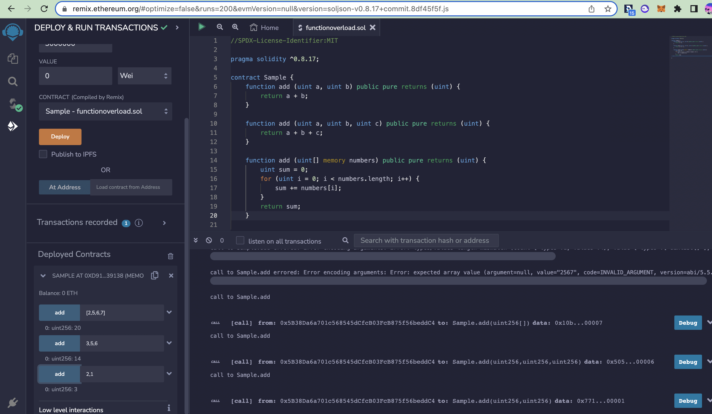

# Function overloading

You can have multiple definitions for the same function name in the same scope. The definition of the function must differ from each other by the types and/or the number of arguments in the argument list. You cannot overload function declarations that differ only by return type.

In the sample contract, there are three functions with the same name add, but each function takes different number of parameters.

* first function takes two parameters (uint a, uint b)
* second function takes three parameters (uint a, uint b, uint c)
* third function takes a single parameter (uint[] memory numbers)

When you call the function add with different number of parameters, the smart contract will automatically call the appropriate function based on the parameters you passed.

This is an example of function overloading, where multiple functions have the same name but different parameter lists.

*Remix illustration below:*
