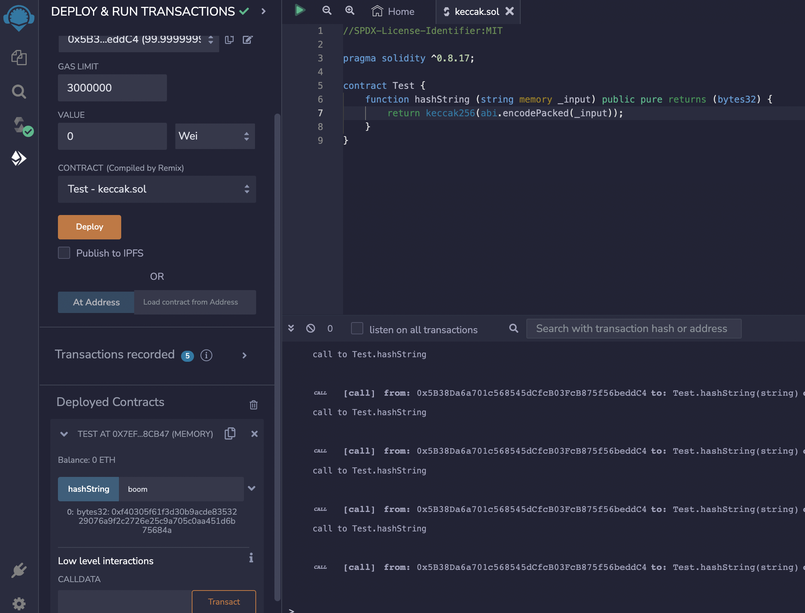

# Cryptographic function 

Solidity provides inbuilt cryptographic function as well. Here is the example function syntax−

keccak256(bytes memory) returns (bytes32) − computes the Keccak-256 hash of the input.

Here is an example of a smart contract written in Solidity that uses the keccak256 function:

This contract has a single function called "hashString" which takes a string as input and returns the keccak256 hash of that string. The keccak256 function is a built-in function in Solidity that returns the keccak256 hash of its input. The abi.encodePacked function is used to convert the input string to bytes before hashing.

*Remix illustration below* *
